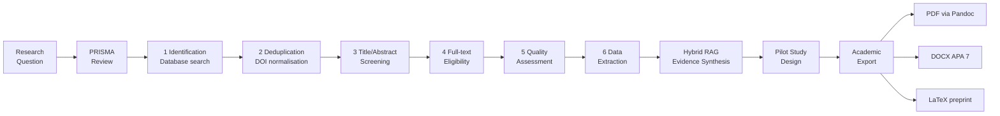

<div align="center">

# 🔬 academic-PRISMA-research-workflow

### AI-powered systematic review and pilot study design for rigorous academic research

[](https://claude.ai/code)
[](https://python.org)
[](https://modelcontextprotocol.io)
[](https://www.prisma-statement.org)
[](LICENSE)

[Problem](#-the-problem) · [Theory](#-theoretical-framework) · [Pipeline](#-research-pipeline) · [Skills](#-core-skills) · [MCP Servers](#-academic-mcp-servers) · [Quick Start](#-quick-start) · [Ecosystem](#-ai-wiki-ecosystem)

</div>

---

## 🎯 The Problem

Systematic literature reviews — the gold standard of evidence-based research — are notoriously labour-intensive. A rigorous PRISMA review of a single research question can take 6–18 months of manual screening, data extraction, and quality assessment (Gough et al., 2017). For researchers in education technology and learning sciences, this creates a bottleneck: evidence synthesis cannot keep pace with the rate at which new empirical studies are published.

This workflow transforms Claude Code into a **specialised research orchestrator** that automates the most time-consuming stages of the PRISMA process while preserving full methodological rigour — every decision is logged, every inclusion/exclusion is justified, and all outputs are audit-ready.

---

## 📚 Theoretical Framework

### PRISMA 2020
The workflow follows the [PRISMA 2020 statement](https://www.prisma-statement.org) (Page et al., 2021) — the current international standard for reporting systematic reviews. All pipeline stages map directly to the PRISMA flow diagram: identification, screening, eligibility, and inclusion.

### Evidence-Based Education & Visible Learning
The research design module is grounded in Hattie's synthesis of 800+ meta-analyses (Hattie, 2009). Effect size thresholds (d > 0.40) and construct validity criteria follow Visible Learning methodology, ensuring that pilot study designs are calibrated against established benchmarks.

### Campbell Collaboration & Cochrane Methodology
Quality assessment criteria follow the Campbell Collaboration's systematic review standards (Campbell Collaboration, 2023) and Cochrane's risk-of-bias framework — adapted for educational and social science contexts where randomisation is often infeasible.

### Open Science Principles
All research outputs target open repositories (Zenodo, OpenAIRE) and open-access journals (DOAJ). The workflow aligns with Nosek et al.'s (2015) open research culture principles: pre-registration, data sharing, and reproducible analysis pipelines.

---

## 🔄 Research Pipeline



### State-Handoff Pattern
Each pipeline stage produces a structured **state file** (JSON + Markdown) that persists across Claude Code sessions. A researcher can pause at any stage, resume in a new session, and the system reconstructs full context from the state file — no information is lost between sessions.

```
research-state/
  prisma-identification.json    # raw search results + dedup log
  prisma-screening.json         # inclusion/exclusion decisions + justifications
  prisma-extraction.json        # data matrix (study, n, effect size, RoB)
  synthesis-evidence.md         # narrative synthesis + forest plot data
  pilot-design.md               # quasi-experimental protocol
  export-manifest.json          # Pandoc pipeline config
```

---

## 🛠 Core Skills

### PRISMA Review (6 phases)

| Phase | Automation | Human Gate |
|---|---|---|
| **1. Identification** | Multi-database query via MCP (ERIC, OpenAIRE, Semantic Scholar, CORE) | Confirm search strings |
| **2. Deduplication** | DOI normalisation + title fuzzy matching | Review edge cases |
| **3. Title/Abstract Screening** | LLM classification against PICO criteria | Validate exclusion log |
| **4. Full-text Eligibility** | PDF extraction + eligibility checklist | Confirm borderline cases |
| **5. Quality Assessment** | Risk-of-bias rubric (Campbell/Cochrane adapted) | Final quality scores |
| **6. Data Extraction** | Structured table: study, n, effect size, RoB, design | Verify extraction matrix |

### Hybrid RAG — Evidence Synthesis
Combines **dense retrieval** (bge-m3 vector embeddings of full-text PDFs) with **sparse BM25 retrieval** for high-recall synthesis. The hybrid approach compensates for semantic drift in technical terminology while maintaining precision on conceptual queries. Outputs a citation-grounded narrative synthesis ready for the Discussion section of a paper.

### Pilot Study Design
Generates quasi-experimental study protocols with:
- Theoretical grounding (mapped to established learning science constructs)
- Sample size calculation (power analysis, α=0.05, power=0.80)
- Ethical compliance checklist (GDPR data minimisation · MIUR research ethics guidelines)
- Measurement instruments (validated scales with psychometric properties)
- Timeline and milestone structure

### Academic Export
Pandoc pipeline producing publication-ready outputs from a single Markdown source:

```bash
pandoc synthesis.md \
  --citeproc --bibliography=refs.bib \
  --csl=apa-7.csl \
  -o output.pdf    # or .docx, .tex
```

Supports: APA 7th · Chicago 17 · Vancouver · journal-specific CSL styles.

---

## 🌐 Academic MCP Servers

Six custom MCP servers connect Claude directly to the global academic record:

| Server | Coverage | Key Use Case |
|---|---|---|
| **ERIC** | Education research (US Dept. of Education) | Curriculum, pedagogy, learning outcomes |
| **OpenAIRE** | European open-access research + Horizon Europe | EU-funded edtech studies |
| **CORE** | 200M+ open-access full texts | Full-text eligibility screening |
| **DOAJ** | Peer-reviewed open-access journals | Journal quality verification |
| **Zenodo** | Preprints, datasets, Horizon Europe deliverables | Grey literature + datasets |
| **Semantic Scholar** | Citation graph + semantic similarity | Related work discovery |

Each server implements the [Model Context Protocol](https://modelcontextprotocol.io) specification, exposing search, fetch, and metadata tools that Claude invokes autonomously during pipeline execution.

---

## 🔬 Technical Deep-Dive

### Skill Architecture
Claude Code skills are Markdown files placed in `~/.claude/skills/`. Each skill contains:
- **Role definition** — constrains Claude to a specific research persona
- **Phase instructions** — step-by-step protocol with decision criteria
- **Output schema** — JSON/Markdown format for state files
- **Quality gates** — conditions that must be met before advancing

### State File Format (example: screening phase)
```json
{
  "phase": "screening",
  "timestamp": "2026-05-30T10:00:00Z",
  "research_question": "...",
  "pico": { "P": "...", "I": "...", "C": "...", "O": "..." },
  "included": [{ "doi": "...", "title": "...", "rationale": "..." }],
  "excluded": [{ "doi": "...", "reason": "criterion_3", "detail": "..." }],
  "pending_human_review": ["doi:..."]
}
```

### Export Pipeline
```
synthesis.md → [Pandoc 3.x] → PDF (LaTeX engine: xelatex)
                             → DOCX (reference.docx APA template)
                             → TEX (Overleaf-compatible)
```

---

## 🚀 Quick Start

### 1. Install Skills

```bash
# Clone the repo
git clone https://github.com/giovannifrontera/academic-PRISMA-research-workflow
cd academic-PRISMA-research-workflow

# Copy skills to Claude Code
cp -r skills/* ~/.claude/skills/          # Linux/Mac
# Copy-Item -Recurse skills\* $env:USERPROFILE\.claude\skills\  # Windows
```

### 2. Configure MCP Servers

```bash
claude mcp add eric python mcp-servers/eric/server.py
claude mcp add openaire python mcp-servers/openaire/server.py
claude mcp add core python mcp-servers/core/server.py
claude mcp add semantic-scholar python mcp-servers/semantic-scholar/server.py
```

See `docs/mcp-setup.md` for full configuration including API keys.

### 3. Start a Review

Open Claude Code in any project directory and invoke:

```
/prisma-review "What is the effect of spaced repetition on long-term retention in higher education?"
```

---

## 🌐 AI-Wiki Ecosystem

This project is part of a coherent research toolchain for AI-augmented academic knowledge management:

| Project | LLM | Role |
|---|---|---|
| [ai-wiki-graph-RAG-lms](https://github.com/giovannifrontera/ai-wiki-graph-RAG-lms) | Anthropic / OpenAI | LTI 1.3 backend for Moodle, Canvas, Blackboard, Sakai, Open edX |
| [ai-longterm-wiki-memory-ClaudeCode](https://github.com/giovannifrontera/ai-longterm-wiki-memory-ClaudeCode) | Claude | Native Claude Code integration — MCP + hooks |
| [ai-longterm-wiki-memory-OpenClaw](https://github.com/giovannifrontera/ai-longterm-wiki-memory-OpenClaw) | Any (LLM-agnostic) | OpenClaw plugin — works with any model via Telegram, Discord, web |
| **academic-PRISMA-research-workflow** ← *you are here* | Claude | Systematic review automation — feeds evidence-based content into the wiki |

---

## 📖 References

1. Page, M. J., McKenzie, J. E., Bossuyt, P. M., et al. (2021). The PRISMA 2020 statement: an updated guideline for reporting systematic reviews. *BMJ*, 372, n71. https://doi.org/10.1136/bmj.n71
2. Hattie, J. (2009). *Visible Learning: A Synthesis of Over 800 Meta-Analyses Relating to Achievement*. Routledge.
3. Campbell Collaboration. (2023). *Systematic reviews in social science and education*. https://www.campbellcollaboration.org
4. Nosek, B. A., Alter, G., Banks, G. C., et al. (2015). Promoting an open research culture. *Science*, 348(6242), 1422–1425. https://doi.org/10.1126/science.aab2374
5. Gough, D., Oliver, S., & Thomas, J. (Eds.). (2017). *An Introduction to Systematic Reviews* (2nd ed.). SAGE.

---

<div align="center">

*Developed by [Giovanni Frontera, Ph.D.](https://github.com/giovannifrontera) · Part of the AI-Wiki Ecosystem*

</div>
