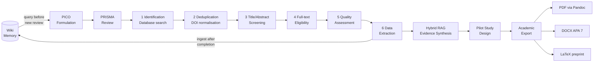

<div align="center">

# 🔬 academic-research-prisma-wiki-rag

### AI-powered systematic review, pilot study design, and preprint publication — with persistent knowledge memory

[](https://claude.ai/code)
[](https://python.org)
[](https://modelcontextprotocol.io)
[](https://lancedb.com)
[](https://www.prisma-statement.org)
[](LICENSE)

[Problem](#-the-problem) · [Theory](#-theoretical-framework) · [Pipeline](#-research-pipeline) · [Skills](#-core-skills) · [Wiki Memory](#-wiki-memory-layer) · [MCP Servers](#-academic-mcp-servers) · [Quick Start](#-quick-start) · [Ecosystem](#-ai-wiki-ecosystem)

</div>

---

> **Extended edition of [`academic-PRISMA-research-workflow`](https://github.com/giovannifrontera/academic-PRISMA-research-workflow) (archived).**
> Same full research pipeline — PICO formulation → PRISMA review → evidence synthesis → pilot study design → preprint export —
> extended with a **persistent LanceDB knowledge layer**: evidence extracted from every review is indexed and retrieved
> automatically in all future sessions. Knowledge compounds across projects instead of resetting each time.

---

## 🎯 The Problem

Systematic literature reviews — the gold standard of evidence-based research — are notoriously labour-intensive. A rigorous PRISMA review of a single research question can take 6–18 months of manual screening, data extraction, and quality assessment (Gough et al., 2017). For researchers in education technology and learning sciences, this creates a double bottleneck: evidence synthesis cannot keep pace with the rate at which new empirical studies are published, and every new review starts from zero even when it overlaps with previous ones.

This workflow transforms Claude Code into a **specialised research orchestrator** that automates the most time-consuming stages of the PRISMA process while preserving full methodological rigour — every decision is logged, every inclusion/exclusion is justified, all outputs are audit-ready — and stores extracted knowledge in a vector index that grows with each completed review.

---

## 📚 Theoretical Framework

### PRISMA 2020
The workflow follows the [PRISMA 2020 statement](https://www.prisma-statement.org) (Page et al., 2021) — the current international standard for reporting systematic reviews. All pipeline stages map directly to the PRISMA flow diagram: identification, screening, eligibility, and inclusion.

### Evidence-Based Education & Visible Learning
The research design module is grounded in Hattie's synthesis of 800+ meta-analyses (Hattie, 2009). Effect size thresholds (d > 0.40) and construct validity criteria follow Visible Learning methodology, ensuring that pilot study designs are calibrated against established benchmarks.

### Campbell Collaboration & Cochrane Methodology
Quality assessment criteria follow the Campbell Collaboration's systematic review standards (Campbell Collaboration, 2023) and Cochrane's risk-of-bias framework — adapted for educational and social science contexts where randomisation is often infeasible.

### Open Science Principles
All research outputs target open repositories (Zenodo, OpenAIRE) and open-access journals (DOAJ). The workflow aligns with Nosek et al.'s (2015) open research culture principles: pre-registration, data sharing, and reproducible analysis pipelines.

---

## 🔄 Research Pipeline



The wiki sits at both ends of the pipeline: queried before each new review to surface relevant prior evidence, and ingested after data extraction to make the new findings available to future reviews.

### State-Handoff Pattern
Each pipeline stage produces a structured **state file** (JSON + Markdown) that persists across Claude Code sessions. A researcher can pause at any stage, resume in a new session, and the system reconstructs full context from state files — no information is lost between sessions.

```
research-state/
  prisma_state.json         # phase tracker, PICO, DB results, wiki_workspace link
  prisma_log.md             # official methodological log → feeds paper Methods section
  screening_log.md          # inclusion/exclusion decisions with justifications
  extraction_matrix.md      # structured data: study, n, effect size, RoB, design
  synthesis-evidence.md     # narrative synthesis + forest plot data
  pilot-design.md           # quasi-experimental protocol
  export-manifest.json      # Pandoc pipeline config
```

The `wiki_workspace` field in `prisma_state.json` is the bridge between the PRISMA skill and the wiki memory: the PRISMA skill writes to it; the wiki skill reads from it to ingest or query the correct workspace.

---

## 🛠 Core Skills

### PRISMA Review (6 phases)

| Phase | Automation | Human Gate |
|---|---|---|
| **1. Identification** | Multi-database query via MCP (ERIC, OpenAIRE, Semantic Scholar, CORE) | Confirm search strings |
| **2. Deduplication** | DOI normalisation + title fuzzy matching | Review edge cases |
| **3. Title/Abstract Screening** | LLM classification against PICO criteria | Validate exclusion log |
| **4. Full-text Eligibility** | PDF extraction + eligibility checklist | Confirm borderline cases |
| **5. Quality Assessment** | Risk-of-bias rubric (Campbell/Cochrane adapted) | Final quality scores |
| **6. Data Extraction** | Structured table: study, n, effect size, RoB, design | Verify extraction matrix |

### Hybrid RAG — Evidence Synthesis
Combines **dense retrieval** (BGE-M3 vector embeddings of full-text PDFs) with **sparse BM25 retrieval** for high-recall synthesis. The hybrid approach compensates for semantic drift in technical terminology while maintaining precision on conceptual queries. Outputs a citation-grounded narrative synthesis ready for the Discussion section of a paper.

### Pilot Study Design
Generates quasi-experimental study protocols with:
- Theoretical grounding (mapped to established learning science constructs)
- Sample size calculation (power analysis, α=0.05, power=0.80)
- Ethical compliance checklist (GDPR data minimisation · MIUR research ethics guidelines)
- Measurement instruments (validated scales with psychometric properties)
- Timeline and milestone structure

### Academic Export
Pandoc pipeline producing publication-ready outputs from a single Markdown source:

```bash
pandoc synthesis.md \
  --citeproc --bibliography=refs.bib \
  --csl=apa-7.csl \
  -o output.pdf    # or .docx, .tex
```

Supports: APA 7th · Chicago 17 · Vancouver · journal-specific CSL styles. Output is Overleaf-compatible (`.tex`).

### Pipeline Orchestrator
The `pipeline-ricerca` skill coordinates the full sequence: PICO formulation → PRISMA → synthesis → pilot design → export. It manages state file handoffs between phases and ensures the wiki is queried at the start and ingested at the end of each completed review.

---

## 🧠 Wiki Memory Layer

This is the distinctive component of this repo. Every completed PRISMA review feeds a persistent knowledge base that is queried automatically at the start of the next one.

### Architecture

```
wiki/
├── wiki-works/ricerca/<project>/    ← per-review knowledge (papers, extractions, syntheses)
│   ├── raw/                         ← PDFs and unprocessed sources
│   ├── entities/                    ← indexed papers and authors
│   ├── concepts/                    ← key findings and constructs
│   └── synthesis/                   ← cross-paper syntheses
├── concepts/                        ← distilled cross-review knowledge
├── synthesis/                       ← promoted cross-project summaries
├── memory/lancedb/                  ← vector index (gitignored, rebuildable)
├── frontend/index.html              ← D3.js knowledge graph browser
└── scripts/
    ├── wiki.py                      ← single CLI entry point
    ├── wiki_embed.py                ← text chunking + BGE-M3 embeddings
    ├── wiki_lancedb.py              ← LanceDB operations
    ├── wiki_server.py               ← FastAPI server for in-session retrieval
    ├── wiki_graph.py                ← D3.js graph data export
    └── wiki_workflows.py            ← automated raw/ → index promotion
```

Knowledge lives in two layers:

| Layer | Path | What goes in |
|---|---|---|
| **Project knowledge** | `wiki-works/ricerca/<project>/` | Papers, syntheses, extraction tables for each PRISMA review |
| **Distilled knowledge** | `wiki/concepts/`, `wiki/synthesis/` | Cross-project concepts, promoted automatically by the `wiki-core` skill |

### Usage from Claude Code

```
# Before starting a new review — surface what we already know
/wiki-core query "spaced repetition effect size in higher education"

# After completing data extraction — persist findings for future reviews
/wiki-core ingest research-state/extraction_matrix.md --project spaced-repetition-2026

# Ingest full-text PDFs
/wiki-core ingest-pdf path/to/paper.pdf --project spaced-repetition-2026
```

### Technical notes
- Embedding model: `BAAI/bge-m3` (multilingual, suited for academic text)
- Vector store: LanceDB (local, no external service required)
- In-session retrieval: FastAPI server on port 7331, queried by the wiki skill before each major operation
- The `memory/lancedb/` directory is gitignored and fully rebuildable from the Markdown sources

---

## 🌐 Academic MCP Servers

Six MCP servers connect Claude directly to the global academic record:

| Server | Coverage | Key Use Case |
|---|---|---|
| **ERIC** | Education research (US Dept. of Education, 1.6M records) | Curriculum, pedagogy, learning outcomes |
| **OpenAIRE** | European open-access research + Horizon Europe | EU-funded edtech studies |
| **CORE** | 220M+ open-access full texts | Full-text eligibility screening |
| **DOAJ** | Peer-reviewed open-access journals | Journal quality verification |
| **Zenodo** | Preprints, datasets, Horizon Europe deliverables | Grey literature + datasets |
| **Semantic Scholar** | Citation graph + semantic similarity | Related work discovery |

Each server implements the [Model Context Protocol](https://modelcontextprotocol.io) specification, exposing search, fetch, and metadata tools that Claude invokes autonomously during pipeline execution.

---

## 🔬 Technical Deep-Dive

### Skill Architecture
Claude Code skills are Markdown files placed in `~/.claude/skills/`. Each skill contains:
- **Role definition** — constrains Claude to a specific research persona
- **Phase instructions** — step-by-step protocol with decision criteria
- **Output schema** — JSON/Markdown format for state files
- **Quality gates** — conditions that must be met before advancing

### State File Format (example: screening phase)
```json
{
  "phase": "screening",
  "timestamp": "2026-05-30T10:00:00Z",
  "research_question": "...",
  "pico": { "P": "...", "I": "...", "C": "...", "O": "..." },
  "wiki_workspace": "/path/to/wiki",
  "included": [{ "doi": "...", "title": "...", "rationale": "..." }],
  "excluded": [{ "doi": "...", "reason": "criterion_3", "detail": "..." }],
  "pending_human_review": ["doi:..."]
}
```

### Export Pipeline
```
synthesis.md → [Pandoc 3.x] → PDF (LaTeX engine: xelatex)
                             → DOCX (reference.docx APA template)
                             → TEX (Overleaf-compatible)
```

---

## 🚀 Quick Start

### 1. Install skills

```bash
git clone https://github.com/giovannifrontera/academic-research-prisma-wiki-rag
cd academic-research-prisma-wiki-rag

cp -r skills/* ~/.claude/skills/          # Linux/macOS
Copy-Item -Recurse skills\* $env:USERPROFILE\.claude\skills\  # Windows
```

### 2. Install wiki dependencies

```bash
pip install -r wiki/requirements.txt
```

### 3. Configure MCP servers

```bash
claude mcp add eric python mcp-servers/eric/server.py
claude mcp add openaire python mcp-servers/openaire/server.py
claude mcp add core python mcp-servers/core/server.py
claude mcp add doaj python mcp-servers/doaj/server.py
claude mcp add zenodo python mcp-servers/zenodo/server.py
claude mcp add semantic-scholar python mcp-servers/semantic-scholar/server.py
```

See `docs/mcp-setup.md` for full configuration including API keys.

### 4. Start a review

Open Claude Code in your research project directory and invoke:

```
/prisma-review "What is the effect of spaced repetition on long-term retention in higher education?"
```

Claude will:
1. Query the wiki for prior evidence on the topic
2. Formulate PICO criteria interactively
3. Run multi-database searches via MCP
4. Deduplicate, screen, assess eligibility — with human gates at each phase
5. Extract data into a structured matrix
6. Ingest the extraction into the wiki
7. Produce a hybrid RAG synthesis
8. Generate a pilot study design if requested
9. Export a preprint-ready document via Pandoc

---

## 🌐 AI-Wiki Ecosystem

| Project | LLM | Role |
|---|---|---|
| [ai-wiki-graph-RAG-lms](https://github.com/giovannifrontera/ai-wiki-graph-RAG-lms) | Anthropic / OpenAI | LTI 1.3 backend for Moodle, Canvas, Blackboard, Sakai, Open edX |
| [ai-longterm-wiki-memory-ClaudeCode](https://github.com/giovannifrontera/ai-longterm-wiki-memory-ClaudeCode) | Claude | Native Claude Code integration — MCP + hooks |
| [ai-longterm-wiki-memory-OpenClaw](https://github.com/giovannifrontera/ai-longterm-wiki-memory-OpenClaw) | Any (LLM-agnostic) | OpenClaw plugin — works with any model |
| [academic-PRISMA-research-workflow](https://github.com/giovannifrontera/academic-PRISMA-research-workflow) | Claude | Base PRISMA workflow without wiki layer (archived) |
| **academic-research-prisma-wiki-rag** ← *you are here* | Claude | Full pipeline + persistent knowledge memory |

---

## 📖 References

1. Page, M. J., McKenzie, J. E., Bossuyt, P. M., et al. (2021). The PRISMA 2020 statement: an updated guideline for reporting systematic reviews. *BMJ*, 372, n71. https://doi.org/10.1136/bmj.n71
2. Hattie, J. (2009). *Visible Learning: A Synthesis of Over 800 Meta-Analyses Relating to Achievement*. Routledge.
3. Campbell Collaboration. (2023). *Systematic reviews in social science and education*. https://www.campbellcollaboration.org
4. Nosek, B. A., Alter, G., Banks, G. C., et al. (2015). Promoting an open research culture. *Science*, 348(6242), 1422–1425. https://doi.org/10.1126/science.aab2374
5. Gough, D., Oliver, S., & Thomas, J. (Eds.). (2017). *An Introduction to Systematic Reviews* (2nd ed.). SAGE.

---

<div align="center">

*Developed by [Giovanni Frontera, Ph.D.](https://github.com/giovannifrontera) · Part of the AI-Wiki Ecosystem*

</div>
