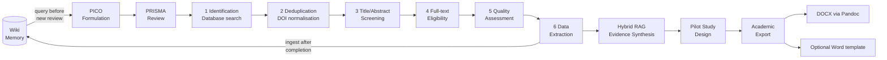

<div align="center">

# 🔬 academic-research-prisma-wiki-rag

### AI-powered systematic review, pilot study design, and preprint publication — with persistent knowledge memory

[](https://claude.ai/code)
[](https://github.com/giovannifrontera/academic-research-prisma-wiki-rag/releases/tag/v1.2.0)
[](https://python.org)
[](https://modelcontextprotocol.io)
[](https://qdrant.tech)
[](https://www.prisma-statement.org)
[](LICENSE)

[Italiano](README.it.md) · **English**

[Problem](#-the-problem) · [Pipeline](#-research-pipeline) · [Skills](#-core-skills) · [Wiki Memory](#-wiki-memory-layer) · [MCP](#-academic-mcp-servers) · [Install](#-quick-start) · [Operations](#-operations-and-troubleshooting) · [Security](#-data-boundaries-and-security)

</div>

---

> **Extended edition of [`academic-PRISMA-research-workflow`](https://github.com/giovannifrontera/academic-PRISMA-research-workflow) (archived).**
> Same full research pipeline — PICO formulation → PRISMA review → evidence synthesis → pilot study design → preprint export —
> extended with a **persistent Qdrant knowledge layer**: evidence extracted from every review is indexed and retrieved
> automatically in all future sessions. Knowledge compounds across projects instead of resetting each time.

---

## 🎯 The Problem

Systematic literature reviews — the gold standard of evidence-based research — are notoriously labour-intensive. A rigorous PRISMA review of a single research question can take 6–18 months of manual screening, data extraction, and quality assessment (Gough et al., 2017). For researchers in education technology and learning sciences, this creates a double bottleneck: evidence synthesis cannot keep pace with the rate at which new empirical studies are published, and every new review starts from zero even when it overlaps with previous ones.

This workflow transforms Claude Code into a **specialised research orchestrator** that automates the most time-consuming stages of the PRISMA process while preserving full methodological rigour — every decision is logged, every inclusion/exclusion is justified, all outputs are audit-ready — and stores extracted knowledge in a vector index that grows with each completed review.

---

## 📚 Theoretical Framework

### PRISMA 2020
The workflow follows the [PRISMA 2020 statement](https://www.prisma-statement.org) (Page et al., 2021) — the current international standard for reporting systematic reviews. All pipeline stages map directly to the PRISMA flow diagram: identification, screening, eligibility, and inclusion.

### Evidence-Based Education & Visible Learning
The research design module is grounded in Hattie's synthesis of 800+ meta-analyses (Hattie, 2009). Effect size thresholds (d > 0.40) and construct validity criteria follow Visible Learning methodology, ensuring that pilot study designs are calibrated against established benchmarks.

### Campbell Collaboration & Cochrane Methodology
Quality assessment criteria follow the Campbell Collaboration's systematic review standards (Campbell Collaboration, 2023) and Cochrane's risk-of-bias framework — adapted for educational and social science contexts where randomisation is often infeasible.

### Open Science Principles
All research outputs target open repositories (Zenodo, OpenAIRE) and open-access journals (DOAJ). The workflow aligns with Nosek et al.'s (2015) open research culture principles: pre-registration, data sharing, and reproducible analysis pipelines.

---

## 🔄 Research Pipeline



The wiki sits at both ends of the pipeline: queried before each new review to surface relevant prior evidence, and ingested after data extraction to make the new findings available to future reviews.

### State-Handoff Pattern
Each pipeline stage produces a structured **state file** (JSON + Markdown) that persists across Claude Code sessions. A researcher can pause at any stage, resume in a new session, and the system reconstructs full context from state files — no information is lost between sessions.

```
research-state/
  prisma_state.json         # phase tracker, PICO, DB results, wiki_workspace link
  prisma_log.md             # official methodological log → feeds paper Methods section
  screening_log.md          # inclusion/exclusion decisions with justifications
  extraction_matrix.md      # structured data: study, n, effect size, RoB, design
  synthesis-evidence.md     # narrative synthesis + forest plot data
  pilot-design.md           # quasi-experimental protocol
  export-manifest.json      # Pandoc pipeline config
```

The `wiki_workspace` field in `prisma_state.json` is the bridge between the PRISMA skill and the wiki memory: the PRISMA skill writes to it; the wiki skill reads from it to ingest or query the correct workspace. Inside a sealed study bootstrapped with `study_workspace.py` (see Quick Start below), this is set automatically to `<study-root>/wiki-memory` — no manual path entry is needed.

---

## 🛠 Core Skills

### PRISMA Review (6 phases)

| Phase | Automation | Human Gate |
|---|---|---|
| **1. Identification** | Multi-database query via MCP (ERIC, OpenAIRE, Semantic Scholar, CORE) | Confirm search strings |
| **2. Deduplication** | DOI normalisation + title fuzzy matching | Review edge cases |
| **3. Title/Abstract Screening** | LLM classification against PICO criteria | Validate exclusion log |
| **4. Full-text Eligibility** | PDF extraction + eligibility checklist | Confirm borderline cases |
| **5. Quality Assessment** | Risk-of-bias rubric (Campbell/Cochrane adapted) | Final quality scores |
| **6. Data Extraction** | Structured table: study, n, effect size, RoB, design | Verify extraction matrix |

### Hybrid RAG — Evidence Synthesis
Combines **dense retrieval** with **sparse BM25 retrieval**, then merges both rankings through Reciprocal Rank Fusion (RRF). Qdrant is the default local backend; ChromaDB and LanceDB remain optional compatibility backends. The review index is deliberately separate from wiki memory and accepts the pipeline's inclusion-export contracts (`eligibility_prisma.json`, `extraction_table.json`, `fase4.paper_inclusi`, or records explicitly marked `included: true`). Screening files without that filename/shape provenance are rejected, explicit exclusion markers always fail validation, and re-indexing removes studies no longer present.

### Pilot Study Design
Generates quasi-experimental study protocols with:
- Theoretical grounding (mapped to established learning science constructs)
- Sample size calculation (power analysis, α=0.05, power=0.80)
- Ethical compliance checklist (GDPR data minimisation · MIUR research ethics guidelines)
- Measurement instruments (validated scales with psychometric properties)
- Timeline and milestone structure

### Academic Export
Pandoc pipeline producing a Word document from a Markdown source:

```bash
pandoc synthesis.md -o output.docx --toc --toc-depth=3
```

Use `--reference-doc=template.docx` when a university or journal Word template is available. PDF, LaTeX and automatic CSL styling are not part of the current skill.

### Pipeline Orchestrator
The `pipeline-ricerca` skill coordinates the full sequence: PICO formulation → PRISMA → synthesis → pilot design → export. It manages state file handoffs between phases and ensures the wiki is queried at the start and ingested at the end of each completed review.

---

## 🧠 Wiki Memory Layer

This is the distinctive component of this repo. Every completed PRISMA review feeds a persistent knowledge base that is queried automatically at the start of the next one.

### Architecture

```
wiki/
├── wiki-works/ricerca/<project>/    ← per-review knowledge (papers, extractions, syntheses)
│   ├── raw/                         ← PDFs and unprocessed sources
│   ├── entities/                    ← indexed papers and authors
│   ├── concepts/                    ← key findings and constructs
│   └── synthesis/                   ← cross-paper syntheses
├── concepts/                        ← distilled cross-review knowledge
├── synthesis/                       ← promoted cross-project summaries
├── memory/qdrant/                   ← vector index (gitignored, rebuildable)
├── frontend/index.html              ← D3.js knowledge graph browser
└── scripts/
    ├── wiki.py                      ← single CLI entry point
    ├── wiki_embed.py                ← text chunking + BGE-M3 embeddings
    ├── wiki_qdrant.py               ← Qdrant operations
    ├── wiki_server.py               ← FastAPI server for in-session retrieval
    ├── wiki_graph.py                ← D3.js graph data export
    └── wiki_workflows.py            ← automated raw/ → index promotion
```

Knowledge lives in two layers:

| Layer | Path | What goes in |
|---|---|---|
| **Project knowledge** | `wiki-works/ricerca/<project>/` | Papers, syntheses, extraction tables for each PRISMA review |
| **Distilled knowledge** | `wiki/concepts/`, `wiki/synthesis/` | Cross-project concepts, promoted automatically by the `wiki-core` skill |

### Usage from Claude Code

```
# Before starting a new review — surface what we already know
/wiki-core query "spaced repetition effect size in higher education"

# After completing data extraction — persist findings for future reviews
/wiki-core ingest research-state/extraction_matrix.md --project spaced-repetition-2026

# Ingest full-text PDFs
/wiki-core ingest-pdf path/to/paper.pdf --project spaced-repetition-2026
```

### Technical notes
- Embedding model: `BAAI/bge-m3` (multilingual, suited for academic text)
- Second-stage reranker: `BAAI/bge-reranker-v2-m3`, with vector-order fallback if unavailable
- Vector store: Qdrant (local, no external service required)
- In-session retrieval: FastAPI server on port 7331, queried by the wiki skill before each major operation
- The `memory/qdrant/` directory is gitignored and fully rebuildable from the Markdown sources
- Models automatically use CUDA when the installed PyTorch build and driver expose it; CPU remains a valid, slower fallback

---

## 🌐 Academic MCP Servers

Six MCP servers connect Claude directly to the global academic record:

| Server | Coverage | Key Use Case |
|---|---|---|
| **ERIC** | Education research (US Dept. of Education, 1.6M records) | Curriculum, pedagogy, learning outcomes |
| **OpenAIRE** | European open-access research + Horizon Europe | EU-funded edtech studies |
| **CORE** | 220M+ open-access full texts | Full-text eligibility screening |
| **DOAJ** | Peer-reviewed open-access journals | Journal quality verification |
| **Zenodo** | Preprints, datasets, Horizon Europe deliverables | Grey literature + datasets |
| **Semantic Scholar** | Citation graph + semantic similarity | Related work discovery |

Each server implements MCP 1.x and exposes search/fetch tools that Claude invokes during the pipeline. Search tools preserve their human-readable text response by default and accept `output_format="json"` for complete machine-readable records, abstracts and pagination metadata.

---

## 🔬 Technical Deep-Dive

### Skill Architecture
Claude Code discovers the skills from the installed plugin's `skills/` directory. Each skill contains:
- **Role definition** — constrains Claude to a specific research persona
- **Phase instructions** — step-by-step protocol with decision criteria
- **Output schema** — JSON/Markdown format for state files
- **Quality gates** — conditions that must be met before advancing

### State File Format (example: screening phase)
```json
{
  "phase": "screening",
  "timestamp": "2026-05-30T10:00:00Z",
  "research_question": "...",
  "pico": { "P": "...", "I": "...", "C": "...", "O": "..." },
  "wiki_workspace": "/path/to/wiki",
  "included": [{ "doi": "...", "title": "...", "rationale": "..." }],
  "excluded": [{ "doi": "...", "reason": "criterion_3", "detail": "..." }],
  "pending_human_review": ["doi:..."]
}
```

### Export Pipeline
```
synthesis.md → [Pandoc 3.x] → DOCX
                              └─ optional reference.docx template
```

---

## 🚀 Quick Start

### 1. Install the plugin

```
/plugin marketplace add giovannifrontera/academic-research-prisma-wiki-rag
/plugin install academic-research-prisma-wiki-rag@academic-research-prisma
```

For local testing without a marketplace, clone the repo and run Claude Code
with `claude --plugin-dir .` from inside it. Skills and the six MCP servers
(ERIC, OpenAIRE, CORE, DOAJ, Zenodo, Semantic Scholar) are all declared in
`.claude-plugin/plugin.json` — no manual `claude mcp add` needed.

### 2. Create one Python environment

Create a virtual environment, activate it, and run `python -m pip install -r "<PLUGIN_ROOT>/requirements.txt"`. Start Claude Code from that same terminal so the MCP servers use the same interpreter. See [Windows/Linux setup and GPU verification](docs/models-and-setup.md).

### 3. Set optional API keys

`CORE_API_KEY` (required for usable CORE rate limits) and
`SEMANTIC_SCHOLAR_API_KEY` (optional, raises Semantic Scholar rate limits)
are read from the environment — export them before starting Claude Code.
See [Models and setup](docs/models-and-setup.md) for environment and key setup details.

### 4. Start a review

Open Claude Code in your workspace and bootstrap a sealed study — either say "let's start a new review" or invoke `/pipeline-ricerca nuova`; both trigger:

```bash
python "<PLUGIN_ROOT>/scripts/study_workspace.py" create --name "Spaced repetition review" --parent "<CURRENT_WORKSPACE>"
```

This creates an isolated `<study-slug>/` study root (layout in [Python, models and portable paths](docs/models-and-setup.md#sealed-study-directory-layout)) with its own `wiki-memory/` — there is no shared/global wiki workspace to configure by hand. Confirm the printed `project_root` with Claude, then start the review from inside it:

```
/prisma-review "What is the effect of spaced repetition on long-term retention in higher education?"
```

Claude will:
1. Query the wiki for prior evidence on the topic
2. Formulate PICO criteria interactively
3. Run multi-database searches via MCP
4. Deduplicate, screen, assess eligibility — with human gates at each phase
5. Extract data into a structured matrix
6. Ingest the extraction into the wiki
7. Produce a hybrid RAG synthesis
8. Generate a pilot study design if requested
9. Export the Markdown report to DOCX via Pandoc

### 5. Verify the installation

```bash
python "<PLUGIN_ROOT>/wiki/scripts/wiki_check_setup.py" --workspace "<W>"
python "<PLUGIN_ROOT>/wiki/scripts/check_models.py" --workspace "<W>"
```

On a CUDA workstation, require GPU placement explicitly:

```bash
python "<PLUGIN_ROOT>/wiki/scripts/check_models.py" --workspace "<W>" --require-cuda
```

The diagnostic performs a real embedding and reranker inference and reports the Python executable, PyTorch/CUDA build, actual model devices and embedding dimension.

---

## ⚙️ Operations and Troubleshooting

| Symptom | Check | Resolution |
|---|---|---|
| Models stay on CPU | `python -c "import torch; print(torch.cuda.is_available(), torch.version.cuda)"` | Install the PyTorch build selected by the official installer for the local OS/driver, then restart Claude from the activated environment |
| MCP server cannot import a package | `python -c "import sys; print(sys.executable)"` | Activate the same virtual environment before launching Claude Code |
| Windows accepts `py` but the plugin fails | `where python` in PowerShell | The plugin launches `python`; ensure the environment's `Scripts` directory is first on `PATH` |
| Index uses old or excluded papers | `python hybrid_rag_template.py status` | Re-run `index-prisma` with the current eligibility export; stale IDs are removed automatically |
| Wiki result quality is low | inspect `wiki.config.json` and run `rebuild` | Keep BGE-M3 dimension at 1024, enable reranking and rebuild after changing embedding model |
| Offline model load fails | inspect the Hugging Face cache | Download once online or provide a populated cache; offline mode cannot fetch missing weights |
| Local Qdrant is locked | check for another process using the same workspace | Stop the other wiki process; do not share one embedded Qdrant directory between concurrent writers |

Windows and Linux share the same Python entry points. Paths must be absolute and quoted; research data stays outside the plugin cache. Detailed commands are in [Python, models and portable paths](docs/models-and-setup.md).

### Test matrix

GitHub Actions runs the Python suite on `ubuntu-latest` and `windows-latest` with Python 3.11 and CPU PyTorch. Local GPU verification is intentionally separate because hosted runners do not expose CUDA. The current regression suite covers wiki workflows, Qdrant retrieval, reranking fallbacks, Hybrid RAG inclusion boundaries and all MCP record formats.

---

## 🔐 Data Boundaries and Security

- The plugin code, wiki workspace and individual review directory are separate locations.
- `memory/qdrant/`, `rag_db/`, PDFs, extraction tables and credentials are research data and must not be committed.
- Hybrid RAG accepts only the documented eligibility filename/shape contracts and rejects explicit exclusion markers. Human confirmation remains a required pipeline gate before producing those exports.
- The wiki HTTP context endpoint accepts loopback callers only. Remote serving requires authentication and deliberate network configuration.
- `CORE_API_KEY`, `SEMANTIC_SCHOLAR_API_KEY` and GitHub credentials are read from the environment; never add them to plugin manifests or documentation.
- Every methodological decision remains in the PRISMA state/log files so automated retrieval does not replace the audit trail or human eligibility gate.

---

## 📚 Documentation Map

| Document | Purpose |
|---|---|
| [Italian README](README.it.md) | Complete Italian edition of this guide |
| [Wiki guide](wiki/README.md) / [Italian](wiki/README.it.md) | Wiki workspace, CLI, server and recovery operations |
| [Models and setup](docs/models-and-setup.md) | Windows/Linux environments, GPU selection and portable paths |
| [Project specification](docs/PROJECT-SPEC.md) | Canonical research pipeline and state contracts |
| [Plugin manifest](.claude-plugin/plugin.json) | Published skills and MCP server declarations |

---

## 📦 Release 1.2.0

- Migrated wiki vector memory to embedded Qdrant and added BGE cross-encoder reranking.
- Corrected Hybrid RAG Qdrant retrieval, pagination, filters, RRF/BM25 behavior and eligibility-only indexing.
- Added complete JSON MCP responses while retaining the text format.
- Added real GPU diagnostics and explicit CPU fallback reporting.
- Hardened Windows locking, Python/path handling and Windows/Linux CI.
- Reconciled the English and Italian documentation with the actual Claude Code plugin.

See [CHANGELOG.md](CHANGELOG.md) for the release history.

---

## 🌐 AI-Wiki Ecosystem

| Project | LLM | Role |
|---|---|---|
| [ai-wiki-graph-RAG-lms](https://github.com/giovannifrontera/ai-wiki-graph-RAG-lms) | Anthropic / OpenAI | LTI 1.3 backend for Moodle, Canvas, Blackboard, Sakai, Open edX |
| [ai-longterm-wiki-memory-ClaudeCode](https://github.com/giovannifrontera/ai-longterm-wiki-memory-ClaudeCode) | Claude | Native Claude Code integration — MCP + hooks |
| [ai-longterm-wiki-memory-OpenClaw](https://github.com/giovannifrontera/ai-longterm-wiki-memory-OpenClaw) | Any (LLM-agnostic) | OpenClaw plugin — works with any model |
| [academic-PRISMA-research-workflow](https://github.com/giovannifrontera/academic-PRISMA-research-workflow) | Claude | Base PRISMA workflow without wiki layer (archived) |
| **academic-research-prisma-wiki-rag** ← *you are here* | Claude | Full pipeline + persistent knowledge memory |

---

## 📖 References

1. Page, M. J., McKenzie, J. E., Bossuyt, P. M., et al. (2021). The PRISMA 2020 statement: an updated guideline for reporting systematic reviews. *BMJ*, 372, n71. https://doi.org/10.1136/bmj.n71
2. Hattie, J. (2009). *Visible Learning: A Synthesis of Over 800 Meta-Analyses Relating to Achievement*. Routledge.
3. Campbell Collaboration. (2023). *Systematic reviews in social science and education*. https://www.campbellcollaboration.org
4. Nosek, B. A., Alter, G., Banks, G. C., et al. (2015). Promoting an open research culture. *Science*, 348(6242), 1422–1425. https://doi.org/10.1126/science.aab2374
5. Gough, D., Oliver, S., & Thomas, J. (Eds.). (2017). *An Introduction to Systematic Reviews* (2nd ed.). SAGE.

---

<div align="center">

*Developed by [Giovanni Frontera, Ph.D.](https://github.com/giovannifrontera) · Part of the AI-Wiki Ecosystem*

</div>
