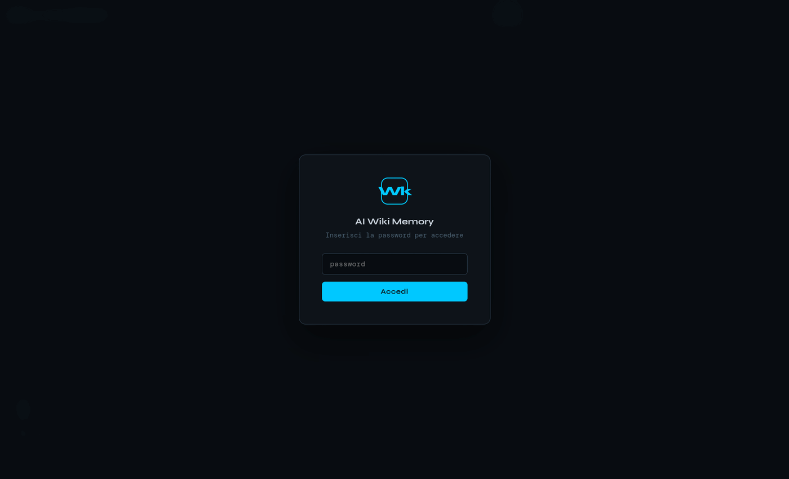
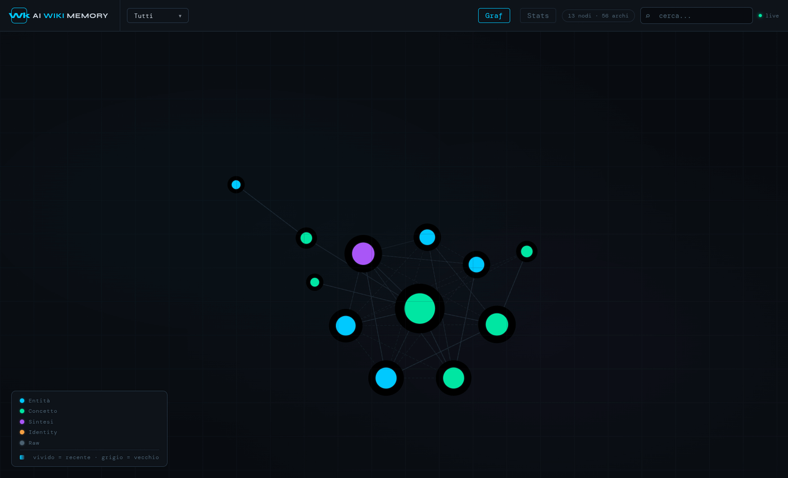
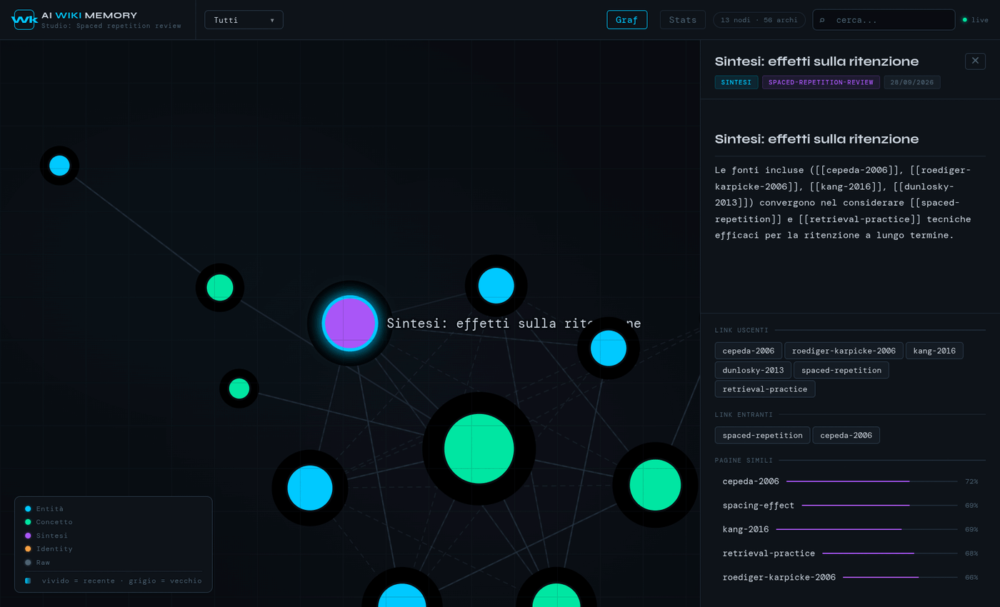
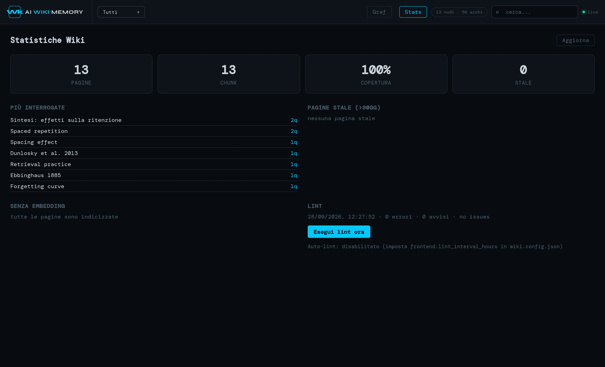

<div align="center">

# 🧠 Memoria Wiki PRISMA

### Conoscenza persistente e ispezionabile per il plugin Academic PRISMA di Claude Code

[](https://github.com/giovannifrontera/academic-research-prisma-wiki-rag/releases/tag/v1.4.2)
[](tests/)
[](https://python.org)
[](https://qdrant.tech)
[](../LICENSE)

**Italiano** · [English](README.md) · [README principale](../README.it.md)

[Concetto](#-cosa-fa-la-wiki) · [Architettura](#️-architettura) · [Retrieval](#-pipeline-di-retrieval) · [Avvio](#-avvio-rapido) · [CLI](#-riferimento-cli) · [Server](#-server-web-locale) · [Ripristino](#-ripristino-e-risoluzione-dei-problemi)

</div>

---

La wiki è la memoria cross-progetto di `academic-research-prisma-wiki-rag`. Non è un plugin OpenClaw separato e non coincide con il database Hybrid RAG della singola revisione. I file Markdown sono la fonte autorevole; Qdrant embedded fornisce il recupero semantico.

## 🎯 Cosa fa la wiki

| Livello | Directory | Scopo | Chi scrive |
|---|---|---|---|
| **Dominio** | `wiki-works/<progetto>/` | Paper, entità, concetti e sintesi del dominio | workflow ingest |
| **Distillato** | `wiki/` | Concetti e sintesi cross-progetto | promozione/ingest controllato |
| **Identità** | `wiki/identity/` | Indicazioni comportamentali stabili | workflow di riflessione |

Tutti i livelli condividono lo stesso spazio Qdrant. Le directory organizzano la proprietà, ma non impediscono la ricerca.

### Invarianti

- Il Markdown è autorevole; `memory/qdrant/` è ricostruibile.
- Le pagine entrano tramite `wiki.py ingest`, da `.md.tmp` in staging e sotto lock.
- Il testo PDF grezzo va in `raw/` prima della trasformazione.
- I path in `exclude_from_index` non entrano nel retrieval.
- CLI e HTTP condividono ranking e reranker.
- Una directory Qdrant embedded ha un solo writer.

---

## 🏗️ Architettura

```text
<W>/                              # dati fuori dal plugin
├── wiki.config.json
├── wiki-session.md                # stato e recovery
├── wiki/
│   ├── concepts/  ├── entities/  ├── synthesis/  └── identity/
├── wiki-works/<progetto>/
│   ├── raw/  ├── concepts/  ├── entities/  └── synthesis/
├── pdf-inbox/.registry.json
└── memory/qdrant/                # indice locale generato

<PLUGIN_ROOT>/wiki/                 # codice, mai dati di ricerca
├── scripts/wiki.py                 # entry point CLI
├── scripts/wiki_workflows.py       # ingest/query/lint
├── scripts/wiki_embed.py           # chunking e BGE-M3
├── scripts/wiki_qdrant.py          # operazioni Qdrant
├── scripts/wiki_rerank.py          # ranking cross-encoder
├── scripts/wiki_pdf_watcher.py     # ingresso PDF
├── scripts/wiki_graph.py           # grafo e pagine
├── scripts/wiki_server.py          # FastAPI, auth, WebSocket
└── frontend/index.html             # UI D3
```

### Ingest in staging e recovery

```text
pagine .md.tmp → lock → validazione → staging Qdrant
                → promozione Markdown + vettori → indice/log/mini-lint → unlock
```

Gli errori prima della promozione non alterano le pagine committate. Un errore tardivo dopo la promozione vettoriale può richiedere `lint --full` e `rebuild` per riallineare Qdrant al Markdown ripristinato; `wiki-session.md` segnala i lavori incompleti o da riparare.

---

## 🔎 Pipeline di retrieval

```text
query → BAAI/bge-m3 (1024d) → candidati Qdrant (k × 4)
      → esclusioni + un chunk/pagina → reranker BGE → estratti top-k
```

CLI e `/api/context` riordinano i chunk completi prima del taglio. Se `BAAI/bge-reranker-v2-m3` fallisce, viene registrata una warning e resta l'ordine vettoriale. Modelli, embedding, Qdrant e reranking lavorano fuori dall'event loop HTTP.

Verifica il dispositivo con inferenza reale:

```bash
python "<PLUGIN_ROOT>/wiki/scripts/check_models.py" --workspace "<W>"
python "<PLUGIN_ROOT>/wiki/scripts/check_models.py" --workspace "<W>" --require-cuda
```

Il JSON riporta Python, Torch/CUDA, device dei due modelli, dimensione e score del reranker.

---

## 🚀 Avvio rapido

Usa Python 3.11+ e un solo ambiente per installazione e Claude Code.

Linux:

```bash
python3 -m venv "/percorso/research-env"
source "/percorso/research-env/bin/activate"
python -m pip install -r "<PLUGIN_ROOT>/requirements.txt"
```

Windows PowerShell:

```powershell
py -3 -m venv "C:/percorso/research-env"
& "C:/percorso/research-env/Scripts/Activate.ps1"
python -m pip install -r "C:/percorso/plugin/requirements.txt"
```

Avvia Claude dallo stesso terminale. Il manifest usa `python`, non l'alias Windows `py`.

Non esiste più un workspace wiki condiviso/globale da configurare a mano: ogni studio riceve automaticamente il proprio `<W>` sigillato. Avvia uno studio con `pipeline-ricerca` (`/pipeline-ricerca nuova`, oppure l'intento in linguaggio naturale "iniziamo una nuova ricerca"):

```bash
python "<PLUGIN_ROOT>/scripts/study_workspace.py" create --name "<nome studio>" --parent "<CURRENT_WORKSPACE>"
```

Questo genera `<CURRENT_WORKSPACE>/<study-slug>/` con `wiki-memory/` già contenente un `wiki.config.json` specifico dello studio — `<W>` qui sotto è `<study-root>/wiki-memory`. Conferma il `project_root` stampato prima di usarlo. Poi esegui:

```bash
python "<PLUGIN_ROOT>/wiki/scripts/wiki_check_setup.py" --workspace "<W>"
python "<PLUGIN_ROOT>/wiki/scripts/wiki.py" rebuild --workspace "<W>"
python "<PLUGIN_ROOT>/wiki/scripts/wiki.py" query --workspace "<W>" --q "domanda di ricerca" --k 5
```

I path devono essere assoluti e tra virgolette. I path di `--pages` sono relativi a `<W>`.

---

## 🧰 Riferimento CLI

```text
python "<PLUGIN_ROOT>/wiki/scripts/wiki.py" <comando> ...

ingest         --workspace <W> --pages <p1.tmp,p2.tmp,...> --log <messaggio>
query          --workspace <W> --q <testo> [--k 5]
lint           --workspace <W> [--full]
index          --workspace <W>
rebuild        --workspace <W>
session-update --workspace <W> --op <tipo> --status <stato> [--detail <json>]
scan-inbox     --workspace <W>
ingest-pdf     --workspace <W> --file <path-locale-o-url>
process-raw    --workspace <W>
serve          --project <study> | --workspace <W> [--host 127.0.0.1] [--port 7331] [--no-auth]
```

Esempi:

```bash
python "<PLUGIN_ROOT>/wiki/scripts/wiki.py" ingest-pdf --workspace "<W>" --file "/dati/paper.pdf"
python "<PLUGIN_ROOT>/wiki/scripts/wiki.py" ingest --workspace "<W>" --pages "wiki-works/ricerca/entities/paper.md.tmp" --log "ingest | paper"
python "<PLUGIN_ROOT>/wiki/scripts/wiki.py" lint --workspace "<W>" --full
```

---

## 🌐 Server web locale

La wiki include un explorer web: un grafo D3 interattivo di tutte le pagine, con dettaglio, pagine semanticamente simili, statistiche e lint, aggiornato in tempo reale via WebSocket mentre Claude scrive nella wiki.

### Avvio

```bash
python "<PLUGIN_ROOT>/wiki/scripts/wiki.py" serve --project "<study>" --host 127.0.0.1 --port 7331
```

In uno studio sigillato `--project` è il punto d'ingresso standard: indica la cartella dello studio o una sua sottocartella e il server apre solo il `wiki-memory` di quello studio (ricavato da `.project-state.json`, con controllo di containment). L'intestazione e la scheda del browser mostrano il nome dello studio. Per esplorare due studi insieme avvia un server per studio su `--port` diverse. `--workspace "<W>"` resta valido per una wiki non sigillata. Apri `http://127.0.0.1:7331` nel browser.

### Accesso



Imposta `WIKI_PASSWORD` prima dell'avvio per scegliere la password. Senza, a ogni avvio ne viene generata una casuale stampata nel terminale: non esiste una password predefinita condivisa. Il cookie di sessione dura `frontend.session_days` (predefinito 7). `--no-auth` disattiva il login solo per uso locale e personale.

### Grafo



- **Nodi**: le pagine wiki, colorate per categoria: entità (paper, autori), concetto, sintesi, identity, raw. La dimensione cresce con i collegamenti; i nodi vividi sono aggiornati di recente, quelli grigi sono vecchi.
- **Archi**: le linee continue sono i `[[link]]` espliciti; quelle tratteggiate sono similarità semantiche calcolate dagli embedding BGE-M3 (compaiono dopo l'indicizzazione).
- **Filtro progetto** (in alto a sinistra): `wiki` (conoscenza trasversale), uno per ogni studio in `wiki-works/`, oppure tutti.
- **Ricerca** (in alto a destra): filtra i nodi per titolo. Il contatore mostra nodi e archi visibili; il punto `live` indica lo stato del WebSocket.

### Dettaglio pagina



Clic su un nodo per aprire la pagina: categoria, progetto e data, testo Markdown, link uscenti ed entranti e pagine più simili con il punteggio di similarità. Clic su un link o su una pagina simile per spostarsi nel grafo.

### Statistiche



Pagine, chunk indicizzati e copertura degli embedding, pagine stale (più vecchie di `thresholds.staleness_days`), pagine più interrogate (da `.wiki-query-log.jsonl`), pagine ancora senza embedding e ultimo esito del lint. **Esegui lint ora** avvia un lint su richiesta; imposta `frontend.lint_interval_hours` in `wiki.config.json` per il lint periodico.

### API e sicurezza

Lo stesso server espone `/api/graph`, `/api/page/<percorso>`, `/api/stats`, `/api/lint`, `/ws` (tutti autenticati) e `/api/context`, interrogato dalla skill wiki per il retrieval in sessione e accessibile solo da loopback. Mantieni `--host 127.0.0.1`: esporre il server in rete richiede una `WIKI_PASSWORD` robusta e una configurazione di rete deliberata.

---

## 🩺 Ripristino e risoluzione dei problemi

| Sintomo | Causa | Azione |
|---|---|---|
| `lock_exists` | altra scrittura o operazione interrotta | verifica il proprietario; non rimuovere un lock vivo |
| GPU attesa, CPU rilevata | Torch CPU, driver o GPU nascosta | esegui `check_models.py --require-cuda` nell'ambiente Claude |
| modello offline assente | pesi non in cache | scarica online o fornisci una cache Hugging Face |
| dimensione errata | indice creato con altro modello | mantieni il modello o usa `rebuild` |
| nessun risultato | indice vuoto/obsoleto o esclusioni | controlla setup/esclusioni e ricostruisci |
| import Windows fallito | Claude usa un altro Python | attiva l'ambiente e avvia Claude dalla stessa PowerShell |
| storage Qdrant in errore | writer concorrenti o permessi | arresta l'altro processo e verifica il path |

Recovery sicuro: leggi `wiki-session.md`; arresta altri writer; esegui `wiki_check_setup.py`; esegui `lint --full`; ricostruisci solo dopo aver validato il Markdown. L'indice è eliminabile, le fonti no.

---

## 🧪 Verifica e documenti

```bash
python -m pytest wiki/tests -q
python -m compileall -q wiki/scripts
```

La CI gira su Windows e Ubuntu. I runner hosted verificano la CPU; l'hardware CUDA usa `check_models.py --require-cuda`.

- [README principale](../README.it.md) / [English](../README.md)
- [Setup Windows/Linux e modelli](../docs/models-and-setup.md)
- [Design](DESIGN.it.md) / [English](DESIGN.md)
- [Specifica](SPEC.it.md) / [English](SPEC.md)
- [Roadmap](ROADMAP.it.md) / [English](ROADMAP.md)

---

<div align="center">Parte di **academic-research-prisma-wiki-rag v1.2.0**</div>
